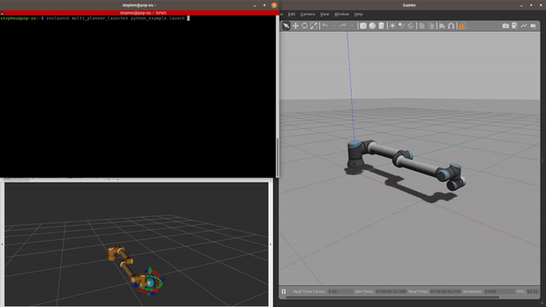

### Load mulitple planners on different namespaces with MoveIt

### To run this example
After you have put the 2 packages from this workspace into yours (or just cloned the entire workspace) and installed the required dependencies,  
1. First bringup the robot in simulation  
`roslaunch multi_planner_launcher bringup_robot.launch`  
2. Now launch the multi-planner launcher which interfaces with movegroup  
`roslaunch multi_planner_launcher multiplanner.launch` 
3. Launch the move-group python interface with   
`roslaunch multi_planner_launcher python_example.launch`  

Checkout the `move_group.launch` file for major namespace changes

#### TODO/ Coming soon
TODO: Example with C++ script  
TODO: Blog post coming soon